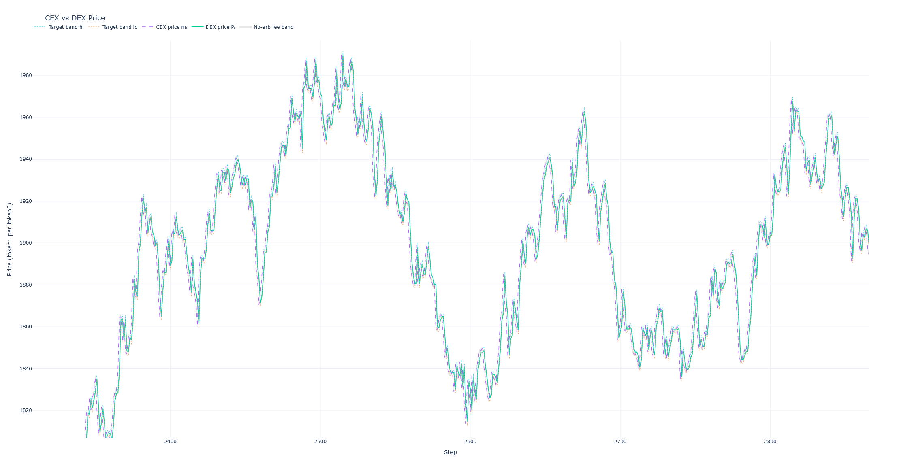

# ABM Uni v3 Simulation (ongoing)

<p align="center">
  
</p>

Agent-based market (ABM) simulator for a Uniswap v3 style pool that extends the Angeris et al. model (“An analysis of Uniswap markets”). The project focuses on **microstructure effects** such as block mempools, asynchronous LP management, dynamic fee schedules, and realistic arbitrage/trader interactions.

The implementation lives in `run.py` and is configured via YAML files consumed by `utils.load_simulation_parameters` (top-level `fee_mode` + a complete `simulate` section). Example scenario configs in this repo live under `abm_results/scenarios/` (see `abm_results/scenarios/test.yml` and the `sigma_sine_fee_*.yml` files). Per-scenario results, plots, and verbose logs are written under `abm_results/scenarios/<scenario_name>/`.

---

## High-Level Features
- **Full Uniswap v3 math**: concentrated-liquidity pool with tick-aware liquidity net, span-by-span fee accounting, and range re-centering logic.
- **Rich agent roster**:
  - **Smart router**: opportunistic trader enforcing best-execution vs. a reference CEX.
  - **Noise trader**: flow provider without valuation discipline, used to stress spreads/liquidity.
  - **Arbitrageur**: clears price discrepancies between the DEX and the CEX reference band; in block mode the arb executes **before** any mempool order (pre-trade CEX vs. DEX snapshot).
  - **LPs**: passive baselines and active narrow LPs. Each LP carries a budget, cooldown, and rebalancing benchmark to compute Loss-versus-Rebalancing (LVR).
- **Block-aware mempool**:
  - `block_time == 1`: deterministic schedule `LP bucket A → smart+noise → LP bucket B → arb → LP bucket C`.
  - `block_time > 1`: freeze the validated snapshot, then run `block_time` micro-steps that diffuse the CEX and probabilistically enqueue smart/noise intents; at the block boundary enqueue a single arb intent plus LP intents (burn/recenter/mint) and replay the shuffled mempool (arb first) against the live pool.
- **Validated price snapshots**: at the end of every block the simulator freezes both the DEX state (tick/S) and the CEX mark. During the following block LPs, noise traders, the arbitrageur, and the smart router all reference this shared “last validated” snapshot (`agent_S_ref`, `agent_tick_ref`, `cex_ref_for_agents`) when forming orders; in block mode the CEX path still diffuses in the background for rebalancing and diagnostics, but mempool orders are priced off the frozen snapshot and executed together at the block boundary.
- **Dynamic fee controller** with four modes:
  - `static` fixes the fee at `f0`.
  - `volatility` adds a multiple of EWMA(|log-return|).
  - `volatility_oracle` uses the per-step CEX volatility path `σ_t` directly as the fee signal (no smoothing); in block mode this can move *within* a block at micro-step resolution based on the current `σ_t`.
  - `toxicity` adds a multiple of the fee-adjusted log basis (in ticks).
  Fee moves are clipped by `fee_step_bps_min/max` and gated by `fee_cooldown` (except for intra-block `volatility_oracle` reactions, which apply immediately but still respect the step-size thresholds).
- **Liquidity bootstrapping**: simulations always start from an evolved/sharded binomial hill that allocates `initial_total_L` across synthetic *seed* LPs (`is_seed=True`) that provide background liquidity and can optionally be plotted; these seed LPs are excluded from the strategic LP cohorts and PnL statistics.
- **LP width rule**: narrow LPs size their ranges off an EWMA of the fee-adjusted basis plus a configurable binomial noise term (`binom_n`, `binom_p`), then clamp to `[w_min_ticks, w_max_ticks]`.
- **Comprehensive telemetry**: per-agent PnL series split by smart router vs. noise trader, liquidity history, fee path, target bands, LP wallet/wealth (hedged vs. unhedged), micro-time traces (block mode), and verbose logs under `abm_results/logs/`.

---

## Agent Behaviour Details

### Reference Market (CEX)
- Implemented as `ReferenceMarket` in `utils.py`.
- Modeled as a GBM over the CEX mid-price with drift `cex_mu` and volatility `σ_t`, plus a permanent impact term of the form
  `impact = kappa * sign(Δa) * |Δa|^{1+xi}` applied to the CEX price in token1 units per token0.
- Volatility can be:
  - **static** (`cex_sigma_mode: static`, using `cex_sigma`);
  - **regime-switching** (`cex_sigma_mode: regime`, two-state Markov chain over `σ_L`/`σ_H` with transition probabilities `p_LL`/`p_HH`);
  - a **noisy sine wave** (`cex_sigma_mode: noisy_sine`) following `σ_t = max(cex_sigma_floor, σ_center + A·sin(2πt/period) + ε_t)` with `ε_t ~ N(0, cex_sigma_sine_noise)`;
  - or **Heston-like stochastic volatility** (`cex_sigma_mode: heston`), where the variance `v_t = σ_t^2` follows a mean-reverting square-root process with parameters `cex_heston_kappa`, `cex_heston_theta`, `cex_heston_sigma_v`, correlation `cex_heston_rho`, and optional initial variance `cex_heston_v0` (falling back to `cex_sigma^2` when omitted).
  The center for the noisy-sine mode defaults to `cex_sigma` (or the midpoint of `cex_sigma_low`/`cex_sigma_high` when provided); in scenarios using `noisy_sine` the amplitude is typically specified explicitly via `cex_sigma_sine_amp`. The active path is returned as `cex_sigma_series` and `cex_regime_series`.
- In non-Heston modes the diffusion step uses `m ← m · exp(cex_mu - 0.5 · σ_t^2 + σ_t · z)` with `z ~ N(0,1)`, so `σ_t` is interpreted directly as the per-microstep volatility (no squaring). In Heston mode, the variance `v_t` and price `m_t` are updated jointly with correlated Gaussian shocks while keeping `σ_t = sqrt(v_t)` in the returned series.
- In non-block mode (`block_time == 1`), each simulation step calls `ref.step(Δa_cex)`, which first applies impact from the net arbitrage flow and then diffuses via GBM/Heston.
- In block mode (`block_time > 1`), the CEX only diffuses during intra-block micro-steps (`ref.diffuse_only()`), while impact from the arbitrage is applied once at the end via `ref.apply_impact_only(Δa_cex)`. This decouples diffusion from impact and matches the code in `run.py`.

#### Heston Volatility Mode (details)
- **Continuous-time model** (conceptual): in Heston mode the CEX price `m_t` and variance `v_t` are thought of as solving
  - \( \mathrm{d}\log m_t = (\mu - \tfrac{1}{2} v_t)\,\mathrm{d}t + \sqrt{v_t}\,\mathrm{d}W_t^{(1)} \)
  - \( \mathrm{d}v_t = \kappa(\theta - v_t)\,\mathrm{d}t + \sigma_v \sqrt{v_t}\,\mathrm{d}W_t^{(2)} \)
  with correlation \( \mathrm{corr}(W^{(1)}, W^{(2)}) = \rho \).
- **Discrete-time implementation** (per micro-step, `Δt = 1` second):
  - The simulator stores the variance as `_heston_v = v_t` and uses `σ_t = sqrt(v_t)` in plots and outputs (`cex_sigma_series`).
  - Each diffusion step (`ReferenceMarket._diffuse_heston`) draws `z1, z2 ~ N(0, 1)` i.i.d. and performs:
    - `v_t = max(_heston_v, 0)` (guard against numerical drift),
    - `dv = kappa * (theta - v_t) * dt + sigma_v * sqrt(max(v_t, 0)) * sqrt(dt) * z1`,
    - `v_next = max(0, v_t + dv)` (full truncation to keep variance non-negative),
    - `_heston_v = v_next` and `sigma = sqrt(max(v_next, 0))` (this `sigma` is what ends up in `cex_sigma_series`),
    - `z_price = rho * z1 + sqrt(1 - rho^2) * z2` (correlated shock for the price, with `rho` clipped to `[-1, 1]`),
    - `log_m_next = log(m_t) + (mu - 0.5 * v_t) * dt + sqrt(max(v_t, 0)) * sqrt(dt) * z_price`,
    - `m_t` is updated to `exp(log_m_next)` and floored at `1e-12` for numerical stability.
- **Initialization and parameter validation**:
  - Heston mode is enabled by `cex_sigma_mode: heston` in the YAML config; `simulate(...)` fails fast if any of the required parameters are missing:
    - `cex_heston_kappa`, `cex_heston_theta`, `cex_heston_sigma_v`, `cex_heston_rho`.
  - Constraints enforced at startup:
    - `cex_heston_kappa > 0`,
    - `cex_heston_theta ≥ 0`,
    - `cex_heston_sigma_v ≥ 0`,
    - `cex_heston_rho ∈ [-1, 1]`.
  - The initial variance is chosen as:
    - `v0 = cex_heston_v0` if provided (must be strictly positive), or
    - `v0 = cex_sigma^2` if `cex_heston_v0` is omitted (requires `cex_sigma > 0`).
    In both cases `sigma_for_ref = sqrt(v0)` is used as the initial per-step volatility in logs.
- **Configuration knobs** (YAML, under `simulate:`):
  - `cex_sigma_mode: heston` — activates the Heston engine.
  - `cex_sigma` — per-step volatility used as `sqrt(v0)` when `cex_heston_v0` is omitted.
  - `cex_heston_kappa` — mean reversion speed of the variance process (higher values pull `v_t` back to `theta` more aggressively).
  - `cex_heston_theta` — long-run variance level.
  - `cex_heston_sigma_v` — volatility of the variance process (controls how “noisy” `v_t` is).
  - `cex_heston_rho` — correlation between price shocks and variance shocks; negative values generate the usual “leverage effect”.
  - `cex_heston_v0` — optional explicit initial variance; when omitted the code uses `cex_sigma^2`.
- **Outputs and plotting**:
  - `cex_sigma_series` continues to contain the *per-step* volatility used in the GBM/Heston update; in Heston mode this is `sqrt(v_t)` at each step.
  - The existing PnL figure (`6_pnl`) uses a volatility subplot whenever the sigma path is dynamic. Heston mode enables this subplot (`sigma_panel = True`) so you can inspect `cex_sigma_series` under the agent PnL panel.
  - The `cex_regime_series` remains available for consistency; in Heston mode it is a simple label (`"H"`) and not used for logic.

### Arbitrageur
- Encoded in `arbitrage_to_target` and the `arb` branch of `execute_mempool_orders` in `run.py`.
- Let \(m^{\text{ref}}_t\) be the **validated** CEX snapshot seen by agents at step \(t\) (`cex_ref_for_agents`) and let \(f_t\) be the taker fee, \(r_t = 1 - f_t\). The arbitrageur defines a **no‑arb band**
  \[
    [P^{\min}_t, P^{\max}_t] = [m^{\text{ref}}_t r_t,\; m^{\text{ref}}_t / r_t].
  \]
  With current DEX price \(P_t\):
  - If \(P_t < P^{\min}_t\) (DEX **cheap**), an “up” arb buys token0 on the DEX and sells token0 on the CEX until \(P_t\) is pushed back up to \(P^{\min}_t\) (or liquidity is exhausted).
  - If \(P_t > P^{\max}_t\) (DEX **expensive**), a “down” arb sells token0 on the DEX and buys it back on the CEX until \(P_t\) is pushed back down to \(P^{\max}_t\).
  The target trade is computed via `swap_exact_to_target`, which integrates the Uniswap v3 price–liquidity curve span‑by‑span.
- In non-block mode, the arbitrageur acts directly on the live pool using the current `ref.m`. In block mode, an `arb` intent is inserted into the mempool against the snapshot \(m^{\text{ref}}_t\) and executed **first** when the mempool is replayed for that block.
- Profit preview (on a cloned pool) is explicitly path‑based:
  - **Cheap DEX (up arb)**: the preview returns a DEX input \(d^{\text{DEX}}_t\) in token1 and an output \(x^{\text{DEX}}_t\) in token0. Selling \(x^{\text{DEX}}_t\) on the CEX at \(m^{\text{ref}}_t\) yields \(x^{\text{DEX}}_t m^{\text{ref}}_t\). Net token1 profit before funding is
    \[
      \Pi^{\text{up}}_t = x^{\text{DEX}}_t m^{\text{ref}}_t - d^{\text{DEX}}_t.
    \]
  - **Expensive DEX (down arb)**: the preview returns a DEX input \(x^{\text{DEX}}_t\) (token0) and output \(y^{\text{DEX}}_t\) (token1). To hedge, the arb must **buy** \(x^{\text{DEX}}_t\) on the CEX, paying \(x^{\text{DEX}}_t m^{\text{ref}}_t\). Net profit is
    \[
      \Pi^{\text{down}}_t = y^{\text{DEX}}_t - x^{\text{DEX}}_t m^{\text{ref}}_t.
    \]
- A configurable `flash_loan_fee` parameter models per-notional funding cost for the arb; before executing, the arbitrageur previews the trade’s PnL **including** this fee and will skip the arbitrage entirely whenever the expected profit (after flash cost) is non-positive.
- Concretely, with funding rate \(\phi = \text{flash\_loan\_fee}\),
  \[
    \Pi^{\text{up, net}}_t = x^{\text{DEX}}_t m^{\text{ref}}_t
      - d^{\text{DEX}}_t
      - \phi\,d^{\text{DEX}}_t,
  \]
  \[
    \Pi^{\text{down, net}}_t = y^{\text{DEX}}_t
      - x^{\text{DEX}}_t m^{\text{ref}}_t
      - \phi\,x^{\text{DEX}}_t m^{\text{ref}}_t.
  \]
  The arb executes only if the previewed \(\Pi^{\text{net}}_t > 0\); otherwise the intent is logged as an “unprofitable” skip.
- PnL is measured in token1 by tracking token flows vs. the **end-of-step** CEX price *after* impact is applied for that block (i.e., at `settlement_m = ref.m`), not the snapshot price used to decide whether to trade.
- As a consequence, the arbitrageur’s cumulative PnL series can exhibit **small downward blips** even though each individual arb is ex-ante profitable at the snapshot: the arb previews and filters trades using the frozen CEX mark (`arb_ref_m`), but realized PnL is later marked to the updated CEX price, so adverse CEX moves between `arb_ref_m` and `settlement_m` can make a given step’s realized arb PnL slightly negative.

### Smart Router
- Implemented via `execute_trader("smart", ...)` and smart-router branches in `execute_mempool_orders`.
- Per potential trade:
  - Draws a **token1 notional**
    \[
      Y^{\text{not}} \sim \exp\bigl(\mathcal{N}(\text{trader\_mean},\;\text{trader\_sigma}^2)\bigr)
    \]
    and a direction `side ∈ {X_to_Y, Y_to_X}` with equal probability.
  - For `X_to_Y` (sell token0 / price‑down):
    - Let \(m_t\) be the CEX price seen by agents at submission time. The intended token0 input is
      \[
        \Delta x^{\text{int}} = \frac{Y^{\text{not}}}{m_t}.
      \]
    - The simulator queries the DEX quote
      \[
        \widehat{\Delta y}^{\text{DEX}}
          = \text{quote\_x\_to\_y}(\Delta x^{\text{int}}),
      \]
      and compares it to the **CEX benchmark** \(\Delta y^{\text{CEX}} = \Delta x^{\text{int}} m_t\).
    - Best‑execution constraint:
      \[
        \widehat{\Delta y}^{\text{DEX}}
          \ge \theta_T \,\Delta y^{\text{CEX}}.
      \]
      If this fails, the trade is routed **entirely to the CEX** (no AMM leg): the trader swaps \(\Delta x^{\text{int}}\) at price \(m_t\), and the corresponding token flows are recorded in the smart‑router PnL and CEX impact.
  - For `Y_to_X` (buy token0 / price‑up):
    - The trader fixes a token1 input \(\Delta y^{\text{int}} = Y^{\text{not}}\).
    - The DEX quote is
      \[
        \widehat{\Delta x}^{\text{DEX}}
          = \text{quote\_y\_to\_x}(\Delta y^{\text{int}}),
      \]
      and the CEX benchmark is \(\Delta x^{\text{CEX}} = \Delta y^{\text{int}} / m_t\).
    - Best‑execution requirement:
      \[
        \widehat{\Delta x}^{\text{DEX}}
          \ge \theta_T \,\Delta x^{\text{CEX}}.
      \]
      If not satisfied, the trade is executed on the CEX only.
  - Slippage control at **execution time**: when mempool orders are replayed the engine re‑quotes the pool against a baseline computed from the last validated DEX price \(P^{\text{ref}}_t = S_{\text{ref}}^2\) and current fee:
    - For `X_to_Y` with input \(\Delta x\), the baseline output is
      \[
        \Delta y^{\text{base}} = \Delta x \, r_t \, P^{\text{ref}}_t.
      \]
    - For `Y_to_X` with input \(\Delta y\),
      \[
        \Delta x^{\text{base}} = \frac{\Delta y \, r_t}{P^{\text{ref}}_t}.
      \]
    The actual execution is skipped if the realized DEX quote violates
    \[
      \frac{\text{actual}}{\text{baseline}} < 1 - \text{slippage\_tolerance},
    \]
    i.e. if the trader would lose more than the configured relative slippage.
- Trade *arrival rates* are configured via `smart_trades_per_block`, interpreted as the **expected number of smart-router intents per block**. Internally this is converted to a per-step/per-micro-step Bernoulli probability `p_smart ≈ smart_trades_per_block / block_time` (clipped to `[0,1]`) that is sampled each micro-step in block mode and each step in non-block mode.
- In non-block mode, smart-router trades execute immediately in the step schedule. In block mode, the smart router simply enqueues intents into the mempool during micro-steps; those intents are executed later in random order when the mempool is replayed.

### Noise Trader
- Implemented via `execute_trader("noise", ...)` and noise branches in `execute_mempool_orders`.
- Shares the same log-normal size process as the smart router (same \(Y^{\text{not}}\) distribution) and chooses direction with equal probability, but **does not** enforce best execution vs. CEX: it always attempts to trade against the AMM, subject only to the same slippage constraint as above.
- Trade arrival is controlled by `noise_trades_per_block`, interpreted as the **expected number of noise intents per block** and converted to a per-step/per-micro-step Bernoulli probability `p_noise ≈ noise_trades_per_block / block_time` (clipped to `[0,1]`) applied at the same cadence as the smart router.
- Provides “uninformed” flow that stresses spreads and liquidity. In block mode these trades are also enqueued into the mempool during micro-steps and executed during the mempool replay.

### Liquidity Providers
- Defined in `agents.py` (`LPAgent`, `Position`, and `RebalancerState`) with management logic in `run.py`.
- **Types**:
  - *Passive baselines* (`is_passive=True` for a fraction `passive_lp_share` of the `N_LP` **strategic** LPs): wide fixed-width ranges, probabilistic mint/burn rules driven by the block-level targets `passive_mints_per_block`, `passive_burns_per_block`, and width `passive_width_ticks`.
  - *Active narrow LPs* (`is_active_narrow=True` and `is_passive=False`): concentrate liquidity near the current mid, recenter after they have been out of range for a random number of steps between `k_out_min` and `k_out_max`, and follow an EWMA-driven width signal with binomial noise.
  - *Seed/background LPs* (`is_seed=True`, always passive): created by `bootstrap_initial_binomial_hill_sharded` to form the initial binomial hill; they provide background liquidity and evolve via the same passive mint/burn rules but are excluded from `N_LP` counts and from the active/passive LP PnL and wealth series.
- **Decision process** (per LP):
  - Each LP carries an internal review clock with inter-review times drawn from a geometric distribution with mean `tau`. In any block an LP is either *not due* (clock has not fired yet) or *due* (clock hits zero); only due LPs are allowed to act.
  - LP activity knobs are specified as **target counts per block** across the population: `narrow_mints_per_block`, `passive_mints_per_block`, and `passive_burns_per_block`. Given `block_time = B`, the passive share, and `N_LP`, the simulator converts these into per-LP Bernoulli probabilities, e.g. `p_narrow_mint ≈ narrow_mints_per_block / (B · N_narrow)`, `p_passive_mint ≈ passive_mints_per_block / (B · N_passive)`, and `p_passive_burn ≈ passive_burns_per_block / (B · N_passive)` (clipped to `[0,1]`), and flips these coins only for LPs whose review clock is due and that are not in cooldown. Realized mint/burn counts therefore fluctuate around the targets and also scale with how many LPs happen to be due in that block (≈ `1/τ` fraction on average) and with cooldowns.
  - After a burn, an LP enters a cooldown for several steps during which it cannot mint again.
  - Narrow LPs track how many consecutive steps their position has been out-of-range (`out_steps`). Once this reaches `k_out_threshold`, they enqueue a recenter intent that targets a symmetric band around the agent’s reference price **using the current EWMA-driven width signal** (the same `w_ticks` rule used for new narrow mints), rather than reusing the original position width.
  - For **active narrow LPs only** (`is_passive=False`), TP/SL logic is **per-position**: for each open `Position`, it computes PnL in token1 terms as `IL_y + fees_value_y` via `Position.PnL_y(agent_S_ref, validated_cex)` and burns that specific position if its PnL exceeds `theta_TP · hodl0_value_y` or falls below `-theta_SL · hodl0_value_y`. Here `hodl0_value_y` is fixed for that position at the time it is minted (including after any recenter), so each recenter creates a new position with its own TP/SL baseline. Passive LPs do **not** use TP/SL; they exit positions only via the probabilistic burn rule.
- **Scheduling and execution**:
  - In non-block mode, LP burns and narrow-LP recenter actions execute directly during their bucket(s) in the per-step schedule A/B/C. New mints are currently handled only in the block-mode mempool path, so for fully budget- and wallet-consistent LP dynamics you should prefer `block_time > 1`.
  - In block mode, all LP actions (burn, recenter, mint) are added to the mempool as intents (`lp_burn`, `lp_recenter`, `lp_mint`) and executed alongside trader orders when the mempool is replayed.
- **Budgets & bootstrap**:
  - Each strategic LP carries a liquidity budget `L_budget` and tracked live deployment `L_live`; new mints are clipped by both a per-step cap (fraction of `L_budget`) and remaining budget.
  - `bootstrap_initial_binomial_hill_sharded` distributes `initial_total_L` across a set of seed LPs (`is_seed=True`) so early burns are staggered and the book has a smooth “hill” shape; these seed LPs are treated as background liquidity and are not counted in `N_LP` or in the passive/active LP cohorts.
- **How mint size is chosen (per step + remaining budget)**:
  - At startup `L_SCALE = initial_total_L / N_LP` and each strategic LP is given `L_budget = 2 · L_SCALE` and `L_live = 0` (reused if missing).
  - Whenever an LP mints (passive or active), draw `X ~ LogNormal(mint_mu, mint_sigma)` and set a *desired* liquidity `want = X · L_SCALE`.
  - Apply two caps before minting:
    - Per-step cap: `cap_step = 0.25 · L_budget` so no single step can deploy more than 25% of that LP’s budget.
    - Remaining budget: `cap_left = max(0, L_budget - L_live)` so total live liquidity never exceeds the budget.
  - The actual mint size is `L_new = min(want, cap_step, cap_left)` . After mint, `L_live` increases by `L_new`; burns and re-centers decrease `L_live` by the burned liquidity, freeing budget for future mints.
- **Width rule for narrow LPs (mathematical form)**:
  - Let \(P_t\) and \(m_t\) be the DEX and CEX prices at the start of step \(t\), and \(f_t\) the taker fee. Define the **fee band in log space**
    \[
      \ell^{\text{fee}}_t = \log\Bigl(\frac{1}{1 - f_t}\Bigr)
    \]
    and the absolute log basis
    \[
      g_t = \bigl|\log P_t - \log m_t\bigr|.
    \]
    The **excess basis** (beyond the fee band) is
    \[
      B_t = \max(0,\; g_t - \ell^{\text{fee}}_t).
    \]
  - An EWMA with half‑life `basis_half_life` smooths this:
    \[
      D_t = \text{EWMA}(B_t),
    \]
    and the corresponding “basis in ticks” is
    \[
      \text{basis\_ticks}_t = \frac{D_t}{\log(1.0001)}.
    \]
  - A binomial width noise term is drawn each step (if `binom_n > 0` and `0 < binom_p < 1`):
    \[
      K_t \sim \text{Binomial}(\text{binom\_n}, \text{binom\_p}),\qquad
      \text{noise\_ticks}_t = (K_t - \text{binom\_n}\,\text{binom\_p}) \cdot \text{tick\_spacing},
    \]
    which has mean zero in “tick‑spacing units”.
  - The raw width in ticks is then
    \[
      w^{\text{raw}}_t
        = w_{\min} + \text{slope\_s} \cdot \text{basis\_ticks}_t
          + \text{noise\_ticks}_t,
    \]
    where `w_min_ticks = w_min`, `w_max_ticks = w_max` are configuration bounds.
  - Let \(\Delta = \text{tick\_spacing}\). The simulator snaps to the grid and enforces integer‑band constraints:
    - Number of bands \(n_b = \max\bigl(1,\;\text{round}(w^{\text{raw}}_t / \Delta)\bigr)\).
    - Minimum and maximum bands
      \[
        n_{\min} = \left\lceil \frac{w_{\min}}{\Delta} \right\rceil,\qquad
        n_{\max} = \max\Bigl(1,\; \left\lfloor \frac{w_{\max}}{\Delta} \right\rfloor\Bigr).
      \]
    - Final width in ticks
      \[
        w^{\text{ticks}}_t = \min\bigl(\max(n_{\min}, n_b), n_{\max}\bigr)\,\Delta.
      \]
    This `w_ticks` is the width used for **new narrow mints** and **recentered bands** in that step.
  - Given a target sqrt‑price \(S^{\text{ref}}_t\) and number of bands \(n_b\), the code solves for a lower tick index \(i_{\text{low}}\) such that the resulting band \([i_{\text{low}}, i_{\text{low}} + n_b \Delta)\) is approximately centered around \(S^{\text{ref}}_t\); the corresponding price band is then
    \[
      [P^{\min}_{\text{band}}, P^{\max}_{\text{band}}]
        = \bigl((\text{base\_s}\,g^{i_{\text{low}}})^2,\;
                (\text{base\_s}\,g^{i_{\text{low}} + n_b \Delta})^2\bigr),
    \]
    where \(g\) is the tick ratio in sqrt‑price.
- **Wealth tracking**:
  - `RebalancerState` maintains a self-financing benchmark that delta-hedges the LP’s token0 exposure using the CEX price; LVR is computed as the difference between LP wealth (wallet plus open position mark-to-market) and this benchmark.
  - Simulation outputs track total and cohort-level PnLs (active vs. passive), rebalancer PnL, wallet balances, and mark-to-market wealth.

---

## Simulation Flow
1. **Initialization**:
   - Parse CLI (`python run.py --config path/to/config.yml`).
   - Load scenario from YAML (see next section).
   - Seed RNGs, build empty pool, generate LP roster, bootstrap liquidity.
2. **Per step (block)**:
   - Copy the validated snapshot into agent-facing variables (`agent_S_ref`, `agent_tick_ref`, `cex_ref_for_agents`).
   - Update/adapt reference CEX (diffusion + impact) and evolve EWMA signals.
   - Randomize actor order depending on `block_time`. In block mode: run micro-steps that diffuse the CEX and enqueue smart/noise + LP intents against the snapshot, then insert an arb intent (using the same snapshot) and replay the mempool (arb first) against the live pool.
   - Apply fees, update LP positions, and settle agent PnL at the post-impact CEX price.
   - Update the dynamic fee controller, log state, and finally capture the new validated snapshot (live DEX + CEX) for the next iteration.
3. **Post-processing**:
   - Generate the default plot suite (prices, LP stats, PnLs, fee path).
   - Compute DEX log-return autocorrelation (saved under `abm_results/png` and `abm_results/html`).
   - Optionally render liquidity GIFs.

---

## Configuration

Scenario YAML files contain a top-level `fee_mode` label plus a `simulate` mapping with every parameter accepted by `simulate(...)`. The loader fails fast on missing/extra keys. A minimal template:

```yaml
fee_mode: static            # scenario label + default fee mode
simulate:
  block_time: 5             # 1 => synchronous mode; >1 => mempool mode
  T: 750                    # number of blocks
  seed: 7
  cex_mu: 0.0
  cex_sigma_mode: static    # "static", "regime", "noisy_sine", or "heston"
  cex_sigma: 0.0015         # used when mode=static
  cex_sigma_low: 0.0001     # regime-switching: σ_L
  cex_sigma_high: 0.002     # regime-switching: σ_H (> σ_L)
  cex_sigma_p_LL: 0.98      # P(Z_{t+1}=L | Z_t=L)
  cex_sigma_p_HH: 0.95      # P(Z_{t+1}=H | Z_t=H)
  cex_sigma_regime_init: L  # starting regime ("L" or "H")
  cex_sigma_sine_period: 10000   # noisy_sine: steps per full cycle
  cex_sigma_sine_amp: 0.0005     # noisy_sine: amplitude (must be set explicitly)
  cex_sigma_sine_noise: 0.0      # noisy_sine: white-noise std added to σ_t (must be set explicitly)
  cex_sigma_sine_phase: 0.0      # noisy_sine: phase offset (radians)
  cex_sigma_floor: 0.0           # noisy_sine: lower bound for σ_t
  # Heston: stochastic variance over σ_t^2 (only used when cex_sigma_mode: heston)
  # cex_heston_kappa: 1.0        # mean reversion speed of variance
  # cex_heston_theta: 1.0e-6     # long-run variance level
  # cex_heston_sigma_v: 0.1      # volatility of variance
  # cex_heston_rho: -0.5         # correlation between price and variance shocks
  # cex_heston_v0: 2.25e-8       # optional initial variance; defaults to cex_sigma^2 when omitted
  smart_trades_per_block: 8.0    # expected smart-router intents per block
  noise_trades_per_block: 6.0    # expected noise intents per block
  narrow_mints_per_block: 200.0  # expected narrow LP mints per block (total across narrow LPs)
  passive_lp_share: 0.2
  passive_mints_per_block: 60.0  # expected passive LP mints per block (total across passive LPs)
  passive_burns_per_block: 10.0  # expected passive LP burns per block (total across passive LPs)
  passive_width_ticks: 500
  N_LP: 500                # number of strategic LP agents (excluding the seed binomial-hill LPs)
  tau: 20
  w_min_ticks: 10
  w_max_ticks: 1_774_540
  basis_half_life: 20
  slope_s: 0.15
  binom_n: 10
  binom_p: 0.5
  trader_mean: 1.0
  trader_sigma: 0.6
  theta_T: 0.95
  slippage_tolerance: 0.01
  mint_mu: 0.05
  mint_sigma: 0.01
  theta_TP: 0.1
  theta_SL: 0.25
  initial_binom_N: 450
  initial_total_L: 500000.0
  k_out_min: 3
  k_out_max: 8
  visualize: true
  skip_step: 300
  f0: 0.003
  f_min: 0.0005
  f_max: 0.05
  fee_half_life: 10
  k_sigma: 50.0
  k_basis: 0.0001
  fee_step_bps_min: 0.001
  fee_step_bps_max: 20.0
  fee_cooldown: 0
```

Any argument of `simulate(...)` can be overridden in the YAML. Keep `fee_mode` in sync with the controller you intend to test.

For a key-by-key description of the telemetry returned by `simulate(...)` (prices, PnLs, fees, LP wealth, activity, etc.), see `docs/simulation_outputs.md`.

---

## Running a Scenario
```bash
python run.py --config abm_results/scenarios/test.yml
```

Outputs:
- `abm_results/scenarios/<scenario_name>/logs/verbose_steps_<fee_mode>_<n>.txt`: human-readable log per step and mempool replay summaries (includes micro-time traces when `block_time>1`).
- `abm_results/scenarios/<scenario_name>/png/` & `abm_results/scenarios/<scenario_name>/html/`: figures summarizing prices, liquidity, agent PnLs (smart vs. noise vs. arb, hedged vs. unhedged LPs), fee path, and width signals. PNG export relies on Kaleido (needs Chrome); HTML files are always written.
- Optional liquidity GIFs can be generated via `utils.make_liquidity_gif(...)` using the recorded `liq_history` and `tick_history` series.
- JSON-like dict returned by `simulate` with all recorded series (see tail of `run.py` for exact keys, including wallet vs. wealth, fee signals, micro-step history, and the active CEX volatility/regime path).

---

## Batch Runners & Analysis Helpers
- `run_scenarios_mean_std.py --scenarios-dir scenarios/ --runs 5`: run every YAML scenario multiple times and emit mean ± std PnL charts for each agent class.
- `run_parameter_grid_mean_std_parallel.py`: parallel grid search over fee modes and fee sensitivities (static, volatility, toxicity) using a base YAML config (see `BASE_CONFIG_PATH` in the script); writes a summary CSV plus PnL/fee violin plots under `abm_results/grid_search/` and mirrors them into the corresponding scenario output root.
- `sigma_calibration.py`: derive realistic per-second `cex_sigma` from Binance 1s ETH/USDC data (CSV/Parquet/pickle) and optionally persist the computed series.
- `visualize_distributions.py`: generate and save figures for the stochastic components used by the simulator (Heston price/volatility paths, binomial-hill initial liquidity, binomial width noise, log-normal trader and LP mint-size distributions, and geometric LP review clocks), useful for validating input distributions and for documentation figures.

For further questions or ideas, open an issue or start a discussion in this repository. Happy simulating!
