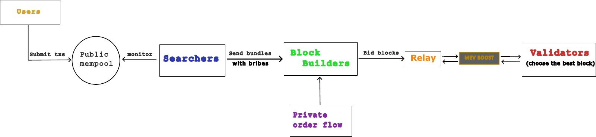
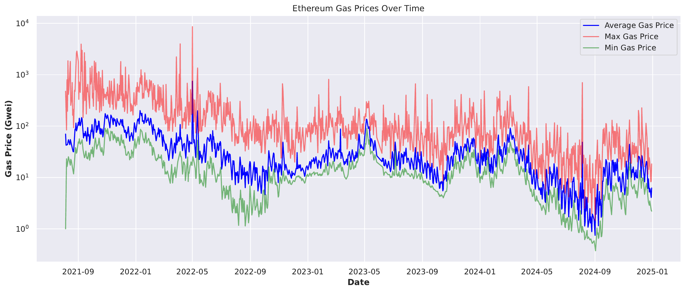
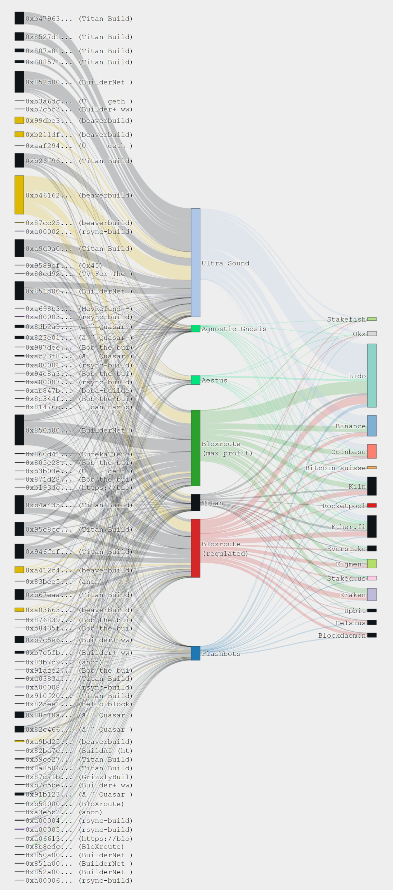
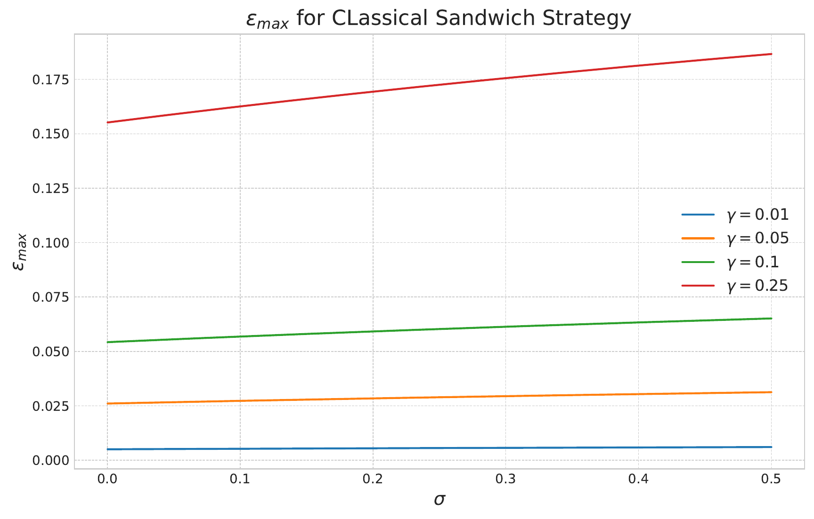
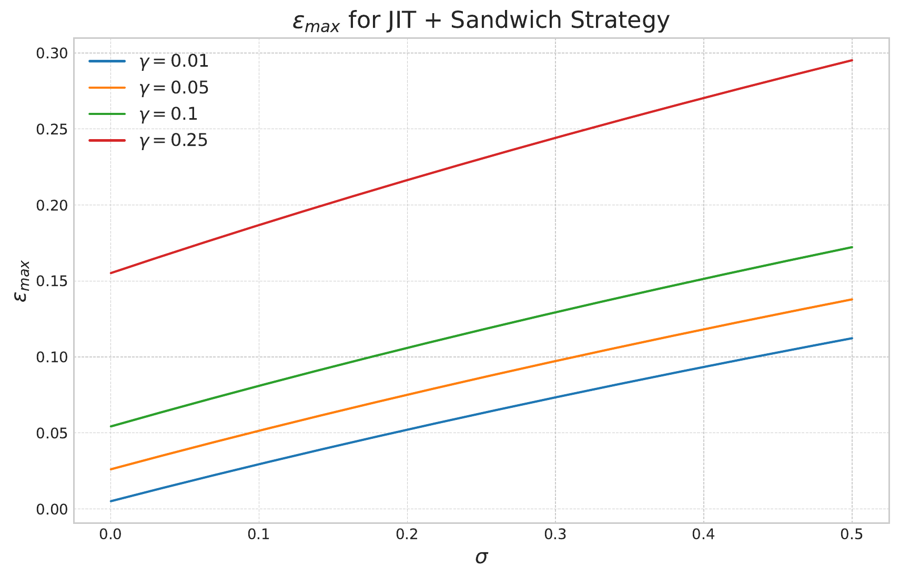
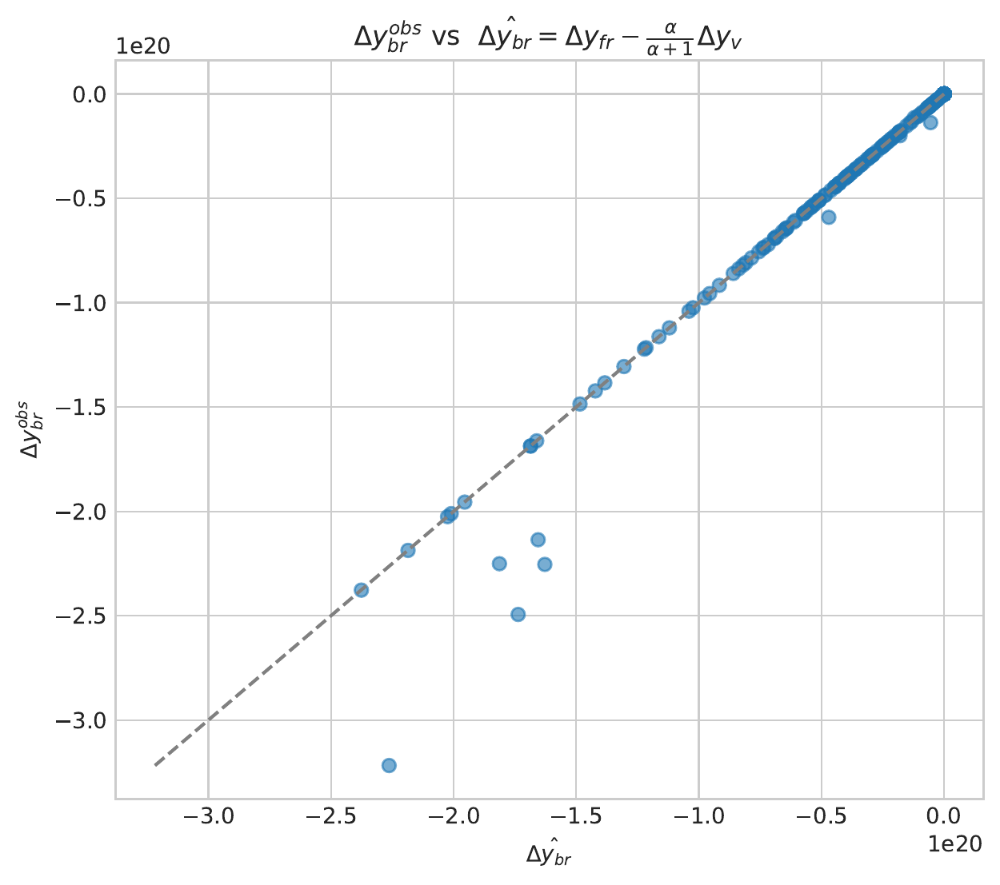
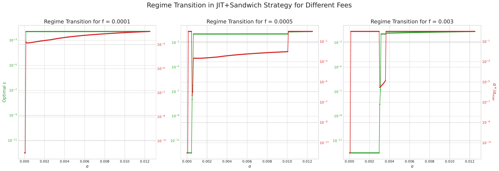
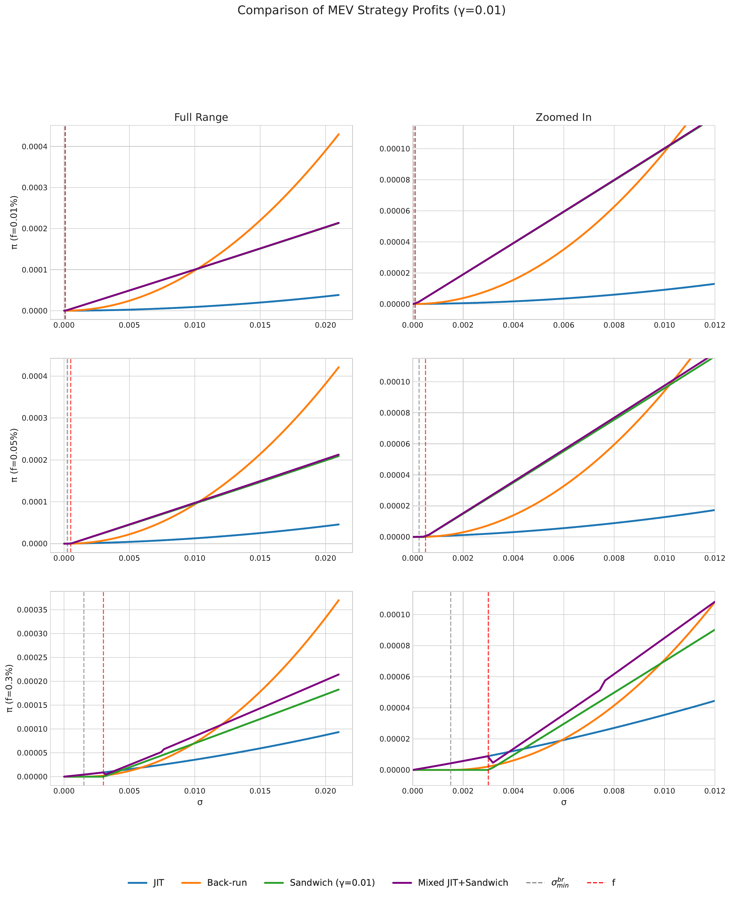
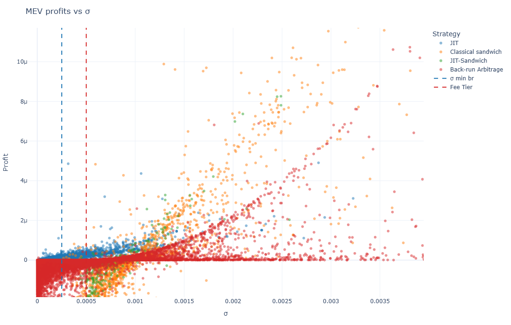

<!-- _class: lead -->
# Maximal Extractable Value (MEV) in Ethereum DEXs  
## Mechanisms and strategy choice (Uniswap v3)

**Author:** Daniele Maria Di Nosse  
**Date:** 2025

---
# Motivation: why MEV exists

- DEX order flow is **batched**: transactions are validated in blocks (≈ 12s cadence on Ethereum)
- Pending transactions wait in the **public mempool**, where details are visible and simulatable
- This enables **value extraction by re-ordering / inserting / censoring** transactions inside a block

**MEV (Maximal Extractable Value):** profit from transaction manipulation on top of fees/rewards.

<!--
Talk track:
- Contrast with TradFi: millisecond timestamps and fragmented venues still allow latency games,
  but the public mempool + atomic execution changes the playing field.
-->

---
# Proposer–Builder Separation (PBS): the MEV supply chain

- PBS separates **block building** (ordering + execution payload) from **block proposing** (consensus signing)
- In practice, PBS is commonly implemented via third-party relays (e.g., MEV-Boost)

---
# Off-chain auctions and gas-price dispersion

- When bidding for inclusion happens **off-chain**, public priority-fee wars are dampened
- But PBS can also **concentrate** power among a small set of professional builders

---
# Actors and payoffs (per block)

- **Searcher** extracts MEV from a bundle, pays gas + direct tips
- **Builder** aggregates bundles, bids to proposer (validator), may rebate order flow
- **Validator (proposer)** selects the highest bid header, earns consensus rewards

One decomposition (per block) is:
$$
\pi_s = M - (C_{\text{gas}} + D_{sb} + C_{s,\text{infra}}),
\qquad
\pi_b = R - (1+\rho)B - R_{\text{refund}} - C_{b,\text{infra}},
\qquad
\pi_v = B + R_{\text{consensus}} - C_{v,\text{infra}}.
$$

---
# Relay-mediated flow (builder → relay → validator)

**Key idea:** builders compete on *bid value*; relays broker the exchange of block headers and payloads.

---
# MEV strategies (focus of this deck)

- **Back-run arbitrage:** trade *after* the victim to harvest the induced spread
- **Sandwich attack:** front-run + victim + back-run (harmful to user; constrained by slippage)
- **Just-in-Time (JIT) liquidity:** mint narrow liquidity before the victim, burn after, capture fees
- **Mixed (sandwich + JIT):** combine price-impact extraction with fee capture

*(Flash loans can fund these strategies atomically.)*

---
# Research question: “which strategy wins?”

Given a victim swap size $S$:

- What is the **maximum profit** (or equivalently, the **maximum bribe**) a searcher can offer while staying non-negative?
- How does the answer depend on:
  - fee tier $f$ (so $r=1-f$),
  - slippage tolerance $\gamma$,
  - and (for JIT) the liquidity multiplier $\alpha$?

---
# Modeling setup (within one Uniswap v3 tick)

Modeling assumption: **single-tick equivalence**

- Pre-strategy reserves: $(x_0, y_0)$, marginal price $P_0 = y_0/x_0$
- Victim size: $S = \sigma x_0$ (normalized size $\sigma$)
- Sandwich front-run: $s = \varepsilon x_0$ (normalized size $\varepsilon$)
- Fee-on-input: $f$, net rate $r = 1-f$
- Ultra-narrow JIT mint: liquidity bump $L \mapsto (1+\alpha)L$ (price-neutral within tick)

All terms are valued in token $X$ using $P_0$.

---
# JIT liquidity: upper-bound profit mechanism

Protocol:
1) mint ultra-narrow liquidity (own fraction $\alpha/(1+\alpha)$ of the active range)  
2) victim swaps $X\to Y$  
3) burn immediately and realize fees + inventory change

Upper bound (hedging costs omitted):
$$
\Pi_{\text{JIT}}
= x_0\left(
\frac{\alpha}{1+\alpha}\,\sigma
- \frac{\alpha r\sigma}{1+\alpha+r\sigma}
\right).
$$

<!--
Notes:
- This is presented explicitly as an upper bound because the JIT LP takes inventory risk and may hedge off-chain.
-->

---
# Back-run arbitrage: optimal trade size

Victim swap (direction $X\to Y$) moves the constant-product price.

Price impact:
$$
I = \frac{P_1}{P_0} - 1 = \frac{1}{(1+r\sigma)^2} - 1.
$$

Optimal back-run exists once the induced spread dominates fees, and yields:
$$
\Pi^*_{\text{br}}(\sigma)
= x_0\,
\frac{\left(\sqrt{r}(1+r\sigma)-1\right)^2}{r(1+r\sigma)}.
$$

---
# Sandwich attack: slippage caps the front-run

The victim sets a **min-out** constraint via slippage tolerance $\gamma$.

- This induces an **upper bound** on feasible $\varepsilon$:
  $$0 \le \varepsilon \le \varepsilon_{\max}(\sigma,\gamma,r).$$
- Even if unconstrained profit has an interior maximum, the attacker is often **stopped by slippage**.

---
# Mixed strategy: JIT increases feasible sandwich size

Bundle sequence (text): front-run swap → JIT mint → victim → JIT burn → back-run swap

Key effect:
- JIT **deepens the book** during the victim leg, relaxing the slippage constraint and allowing larger $\varepsilon$.

---
# Mixed strategy: self-funding back-run (empirical check)

Self-funding condition vs on-chain observations:

- Mixed bundles do **not** generally back-run the same amount as the front-run (JIT hedges part of exposure)

---
# Numerical optimization: regime transition

Numerical maximization over $(\varepsilon,\alpha)$ (with $\alpha$ capped) suggests:
- $\alpha^*$ pushed to the cap across configurations (within the explored range)
- a sharp transition between:
  1) **pure JIT** (tiny $\varepsilon$)
  2) **mixed** (JIT + sandwich component)

---
# Comparing profit ceilings across strategies

Interpretation:
- A “classic” self-funded sandwich can be dominated by back-run arbitrage for large $\sigma$
- Mixed strategy is most profitable in the higher fee tier shown (and close to classic sandwich at lower tiers)
- In these plots, **gas is set to zero** (explicitly stated)

---
# Empirical profits (USDC–WETH 0.05% pool, 2023)

- JIT and sandwich shapes broadly match the theoretical behavior
- Discrepancies: onset of positive profits appears at somewhat larger $\sigma$ than predicted
- Hypotheses: **non-optimal parameters** and/or **cross-tick effects**

---
# Limitations and next steps

- **Single-tick approximation:** cross-tick traversal can shift feasibility/profits
- **Gas and bribes:** strategy comparisons should include realistic costs (here often set to 0)
- **JIT hedging costs:** theory uses an upper bound when ignoring off-chain hedging

<!-- Backup: tick-aware execution rules (multi-tick traversal) are included as appendix material. -->

---
<!-- _class: lead -->
# Appendix (backup)
## Tick-aware Uniswap v3 execution

---
# Tick-aware rules: swaps inside a tick (summary)

Let $q=\sqrt{P}$, active liquidity $L$, fee-on-input $f$ with $r=1-f$.

**X → Y (effective input $x_{\text{eff}}=r x_{\text{in}}$):**
$$
q' = \frac{1}{q^{-1} + x_{\text{eff}}/L},
\qquad
\Delta y = L(q' - q).
$$

**Y → X (effective input $y_{\text{eff}}=r y_{\text{in}}$):**
$$
q' = q + \frac{y_{\text{eff}}}{L},
\qquad
\Delta x = L\left(q^{-1} - (q')^{-1}\right).
$$

<!--
These are the within-tick constant-product updates on virtual reserves (tilde-x, tilde-y) described in the appendix.
-->

---
# References (selected)

- Daian et al., *Flash Boys 2.0: Frontrunning in Decentralized Exchanges, Miner Extractable Value, and Consensus Instability* (IEEE S&P, 2020)
- Adams et al., *Uniswap v3 Core Whitepaper* (2021)
- Heimbach et al., *Risks and Returns of Uniswap V3 Liquidity Providers* (AFT, 2022)
<!-- Several \cite{...} keys in the source are undefined in the local BibTeX file. -->
