# Mitigating Adverse Selection in Concentrated Liquidity AMMs with Dynamic Fees
## An agent-based model approach (Uniswap v3 + blockchain microstructure)

Daniele Maria Di Nosse†, Fabrizio Lillo  
Scuola Normale Superiore, Pisa, Italy  
2026-02-24

<!--
Deck adapted from paper/ABM_paper.tex.
Goal: research-first model + results; avoid implementation details.
-->

---

# Motivation: Why dynamic fees?

- Concentrated liquidity boosts capital efficiency, but amplifies adverse selection risk for LPs.
- In block-based settlement, quotes become stale within the block → systematic arbitrage → **LVR**.
- Core question: can **adaptive fees** internalize adverse selection so LPs earn positive **hedged PnL**?

---

# Contribution (This Work)

- Build a granular ABM of a Uniswap v3 pool coupled to a stochastic reference market (Heston volatility + impact).
- Include blockchain microstructure: blocks, mempool latency, stochastic ordering, priority arbitrage.
- Heterogeneous agents: arbitrageur, noise trader, smart router, passive/active LPs, and a JIT “searcher”.
- Evaluate dynamic fee schedules (volatility- vs toxicity-driven) using hedged LP PnL and DEX market share.

---

# Key Metrics

LP wealth is marked at the CEX mid $m_t$. A self-financing **rebalancing benchmark** $V_t^{reb}$ tracks the LP’s inventory at $m_t$.

$$
\boxed{V_t^{LP} = V_t^{reb} + F_t - \mathrm{LVR}_t}
$$

Hedged profitability (paper definition):
$$
\Pi_t^{hedged} = F_t - \mathrm{LVR}_t - \mathbf{1}_{JIT}C_{flash}.
$$

DEX share (router competitiveness proxy):
$$
\mathrm{DEX}_{share} = \frac{\#\mathrm{DEX\ trades}}{\#(\mathrm{CEX}+\mathrm{DEX})\ trades}.
$$

---

# Timeline: Blocks + Mempool Latency

- Time indexed by blocks $t=1,\dots,T$; each block contains $B$ micro-steps (“seconds”).
- Agents condition on the last validated snapshot:
  $$
  S_t = (P_t^{DEX},\,L_t,\,m_t).
  $$
- Within the block: CEX evolves at micro-step frequency; DEX state is effectively stale for intent formation.
- At the block boundary: replay mempool (arb first, others randomized); record next snapshot.

---

# Agent Roles (High Level)

- **Arbitrageur:** enforces a fee- and funding-implied no-arbitrage band, with priority execution.
- **Smart router:** routes between CEX and DEX as a function of competitiveness (fees + liquidity).
- **Noise trader:** provides exogenous flow (generates fees and mispricings).
- **LPs:** passive (wide) vs active (narrow, frequent review/range management).
- **JIT searcher (optional):** momentarily supplies liquidity around top swap(s) to capture fees.

---

# Reference Market (CEX): Heston + Impact

Stochastic volatility (conceptual SDE):
$$
d\ln m_t = \left(\mu - \tfrac12 v_t\right)dt + \sqrt{v_t}\,dW_t^{(1)},\qquad
dv_t = \kappa(\theta-v_t)dt + \sigma_v\sqrt{v_t}\,dW_t^{(2)}.
$$

Leverage effect via $\mathrm{corr}(dW^{(1)},dW^{(2)})=\rho<0$.
Long-run variance is calibrated using Binance ETH/USD data (2023) in the paper.

Permanent price impact on the CEX from net signed token0 flow $\Delta a_\tau$:
$$
\mathrm{Impact}_\tau = \eta_{imp}\,\mathrm{sign}(\Delta a_\tau)\,\sqrt{|\Delta a_\tau|}.
$$

---

# Arbitrage: No-Arbitrage Band

Let taker fee be $f_t$ and flash-loan funding cost be $\phi_{flash}$.
The implied band for the marginal DEX price is:
$$
\boxed{
\frac{m_t(1-f_t)}{1+\phi_{flash}}
\;\le\;
P_t^{DEX}
\;\le\;
\frac{m_t(1+\phi_{flash})}{1-f_t}.
}
$$

- Outside the band, priority arbitrage trades against the AMM until the boundary is reached (or liquidity is exhausted).

---

# Fee Schedules Tested

Raw fee proposals $f_t^{raw}$ are mapped to applied fees via EWMA smoothing + bounded updates.

EWMA:
$$
v_t = \lambda v_{t-1}+(1-\lambda)x_t,
\qquad
\lambda=\exp\!\left(-\frac{\ln 2}{h}\right).
$$

Schedules in the paper:
- **Static:** $f_t=f_0$.
- **Volatility:** $f_t^{raw}\propto \sqrt{\mathrm{EWMA}((\Delta\ln m_t)^2)}$ (or DEX analog).
- **Toxicity:** $f_t^{raw}\propto$ EWMA(excess CEX–DEX log-gap outside the current fee band).

Controller: bounds $[f_{min},f_{max}]$, hysteresis ($\Delta f_{min}$), step cap ($\Delta f_{max}$), optional cooldown.

---

# Microstructure Signature: CEX vs DEX Prices

- DEX exhibits within-block spikes (aligned intrablock intents) corrected by next-block arbitrage.
- Heston leverage ($\rho<0$) produces negative skewness in CEX returns (visible in distributions).

---

# Microstructure Signature: Within-Block Lag

- CEX moves during micro-steps; DEX executes at block boundary → systematic latency-induced basis.
- Band uses a lagged reference snapshot, structurally shifting relative to contemporaneous $m_t$.

---

# Microstructure Signature: DEX Return ACF

- Pronounced **negative lag-1** autocorrelation: block-time non-atomic CEX–DEX arbitrage induces short-horizon mean reversion.

<!--
Related empirical pattern discussed in the paper (see citations there).
-->

---

# Experiments: Three Model Specifications

- **Model 0:** arbitrageur + noise trader + smart router + passive LPs.
- **Model 1:** add active LP cohort (narrower ranges).
- **Model 2:** add JIT liquidity searcher (fee sniping around largest swap per block).

Reporting:
- PnLs averaged across 50 runs; shaded region is $\pm 2$ standard deviations (in figures).
- Parameters chosen for plausible, interpretable dynamics (not full empirical calibration).

---

# Results (Model 0): Static Fees

| PnLs (mean ± 2 std) | Fee + DEX share |
| --- | --- |
| 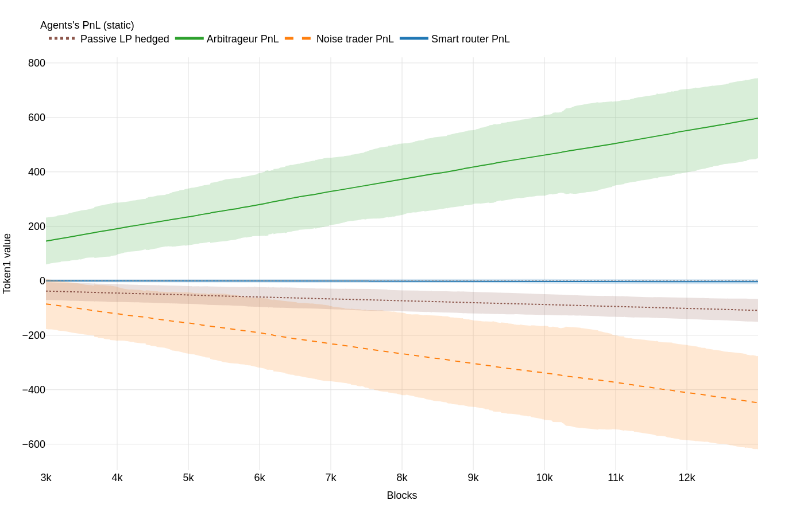 | 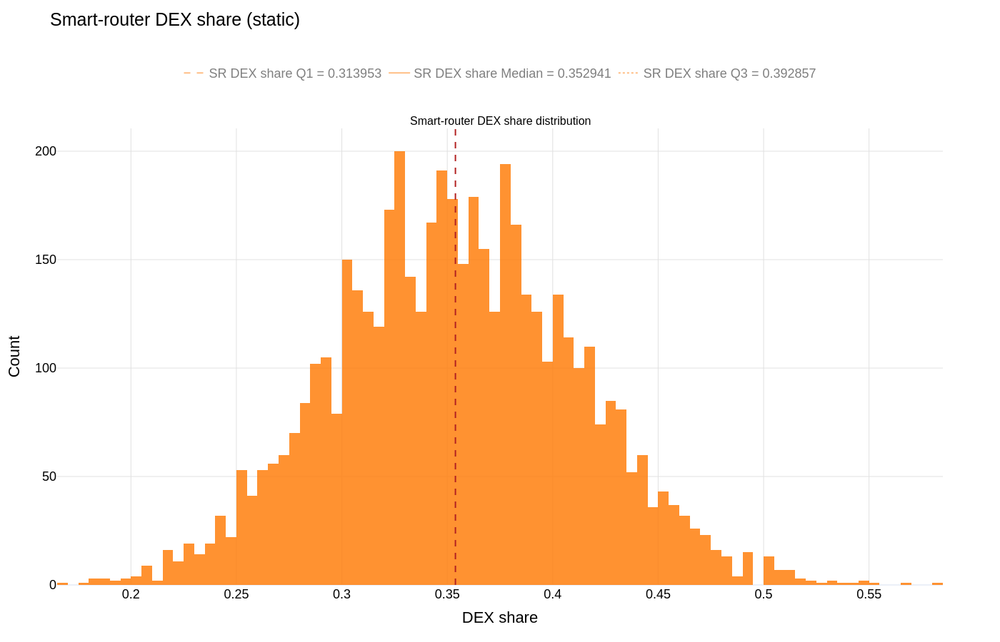 |

- Passive LP hedged PnL is negative; arbitrageur profits are positive.
- DEX retains non-trivial routed flow (paper reports ~35% in this baseline).

---

# Results (Model 0): Toxicity-Driven Fees

| PnLs (mean ± 2 std) | Fee + DEX share |
| --- | --- |
| 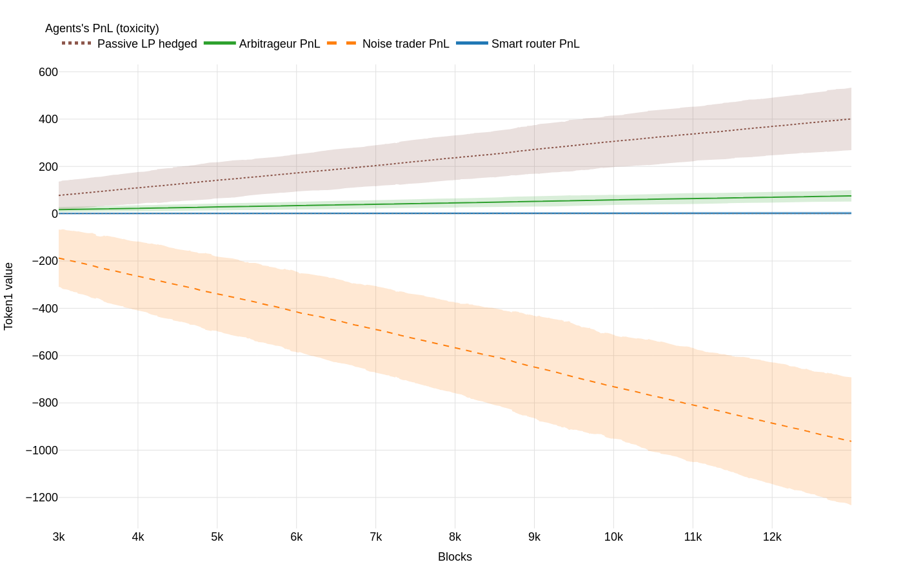 | 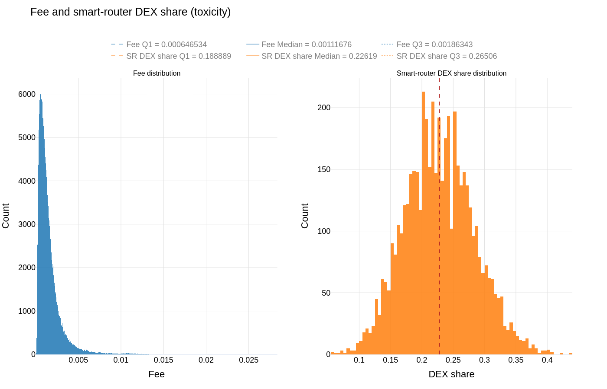 |

- Passive LP hedged PnL becomes positive (and exceeds arbitrageur profits on average).
- Fees rise in adverse-selection regimes; DEX share decreases but remains stable (paper reports ~25%).

---

# Results (Model 0): Volatility-Driven Fees (DEX)

| PnLs (mean ± 2 std) | Fee + DEX share |
| --- | --- |
| 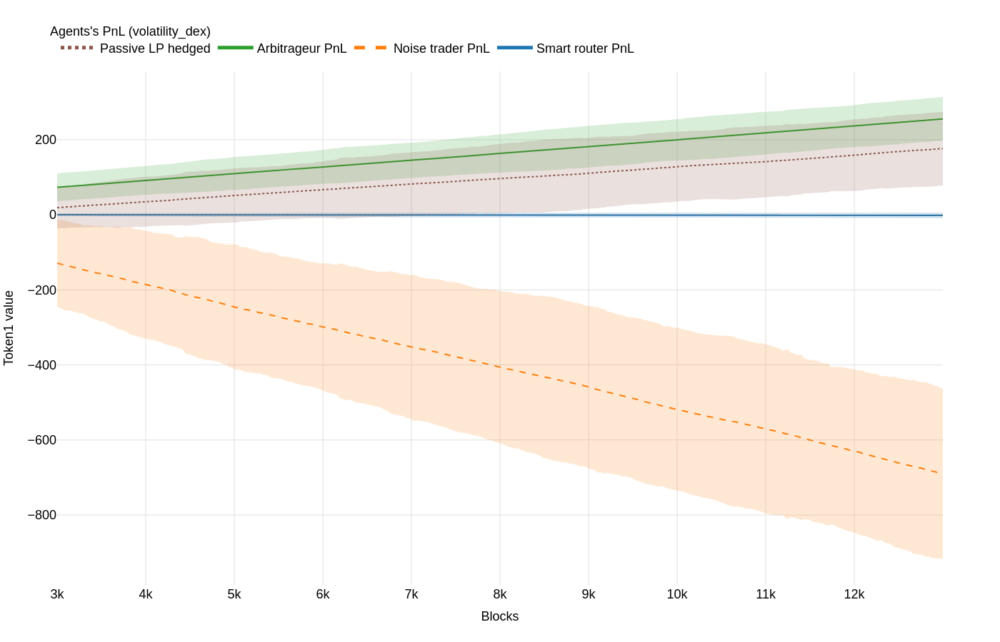 | 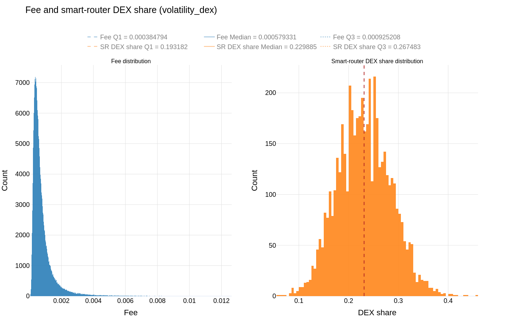 |

- Improves LP outcomes relative to static, but with weaker gains than toxicity in the paper’s experiments.

---

# Results (Model 1): Active LPs (Concentration Trade-off)

| Static fee | Toxicity fee |
| --- | --- |
| 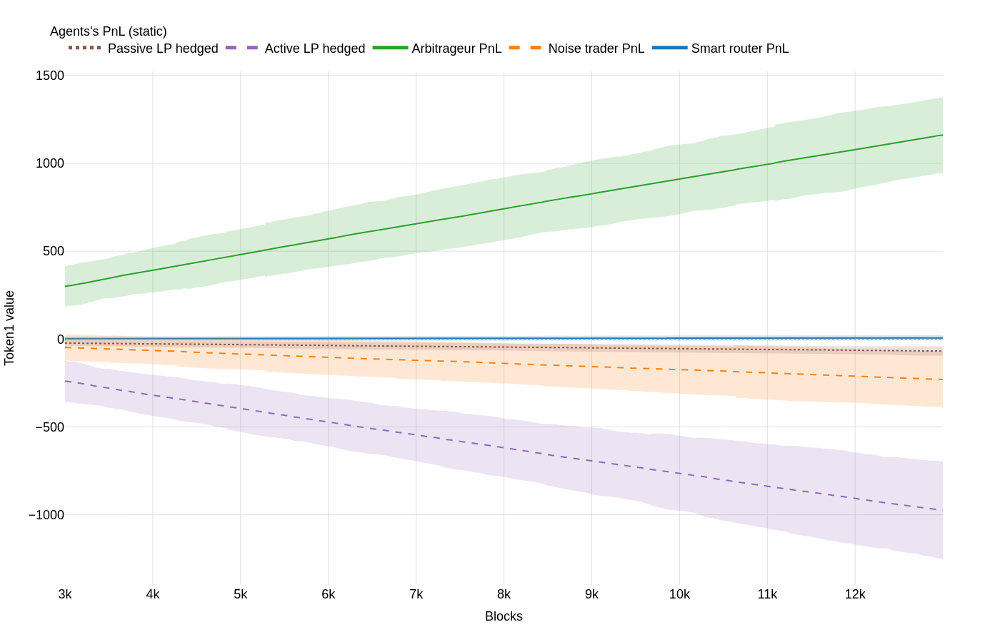 | 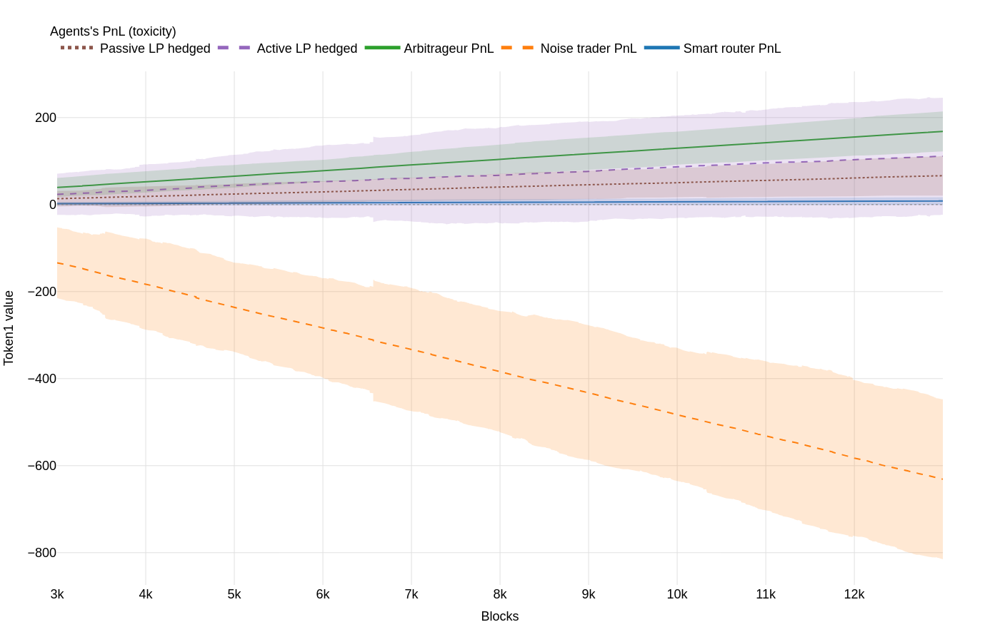 |

- Active LPs (narrow ranges) have higher LVR exposure → worse hedged PnL under static/volatility proxies.
- Paper finding: toxicity-driven fees are the only schedule where **both** passive and active LP cohorts achieve positive hedged PnL.

---

# Results (Model 2): JIT Liquidity (Fee Sniping)

| Static fee | Toxicity fee | Volatility (CEX) |
| --- | --- | --- |
| 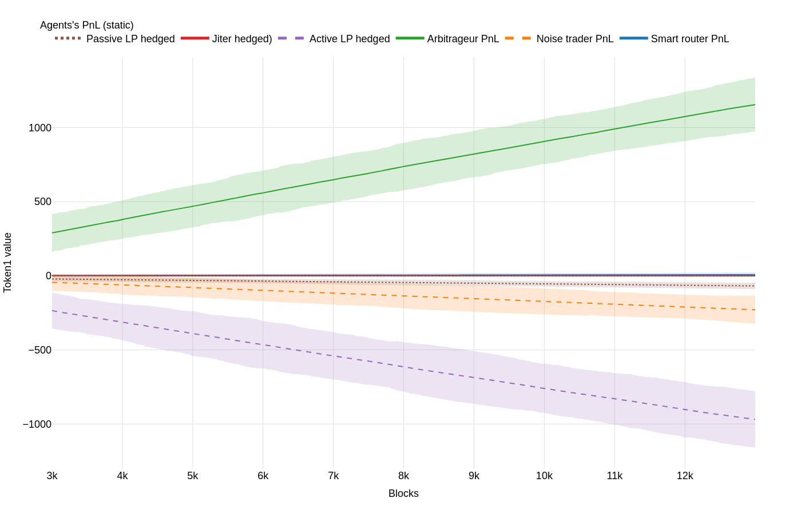 | 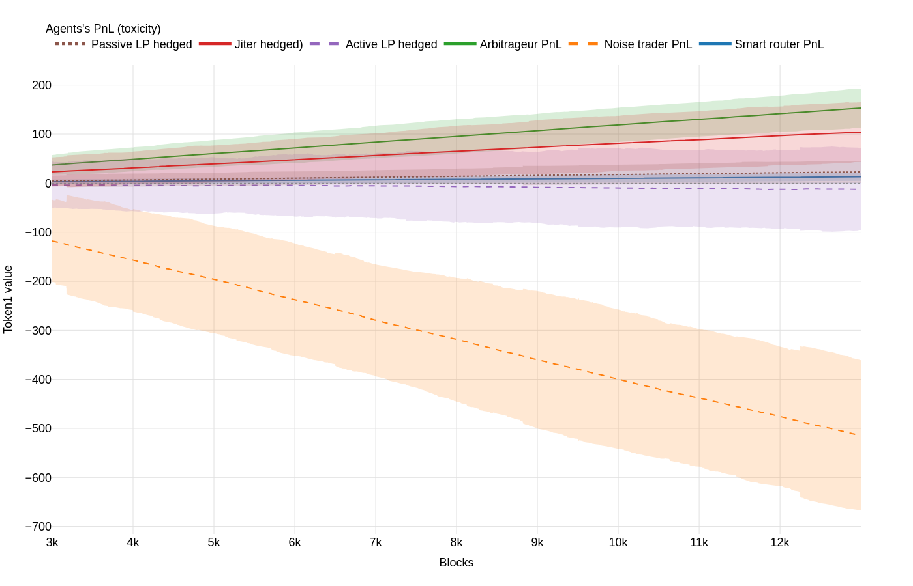 | 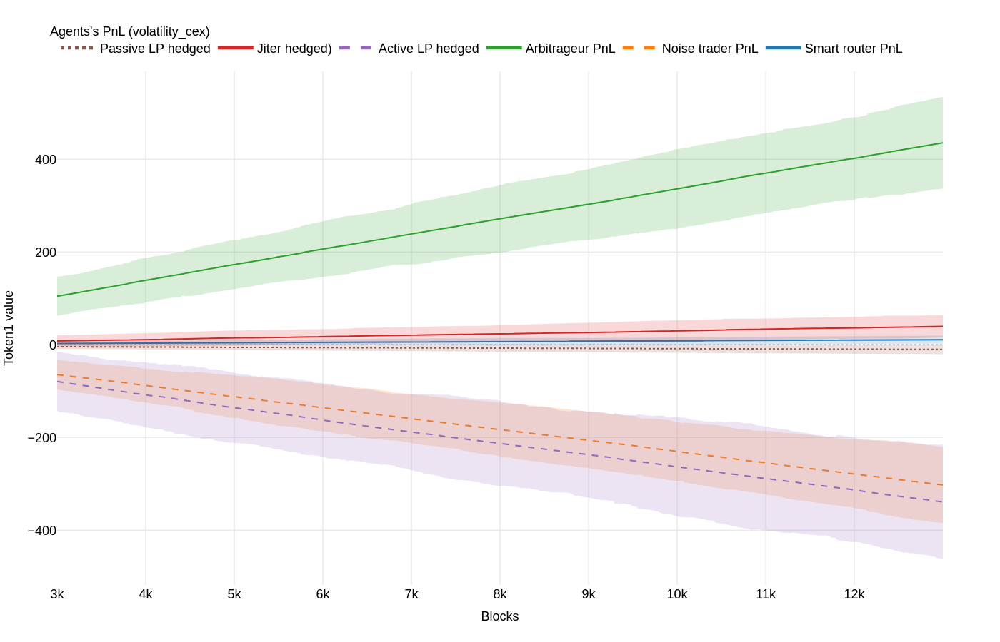 |

- Dynamic fees make the JIT strategy profitable, but passive/active LPs do not achieve consistently positive hedged PnL.
- Interpretation in the paper: dynamic fees increase fee mass in “toxic” blocks that also trigger JIT entry → fee redistribution.

---

# LVR vs Fees vs Block Size

Per-block “coverage ratio”:
$$
R_t=\frac{\Delta \mathrm{LVR}_t}{\Delta F_t}.
$$

| Static | Toxicity |
| --- | --- |
| 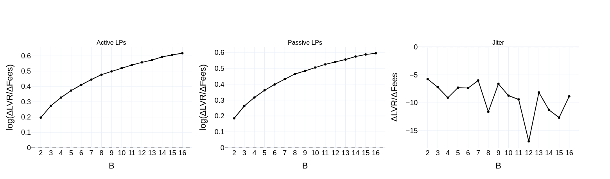 | 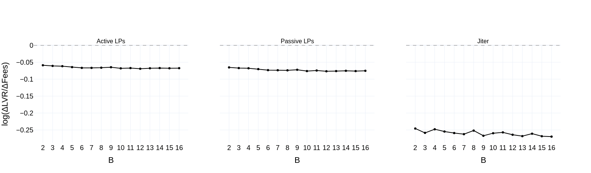 |

- As block time $B$ increases, within-block mispricing grows (variance scales with time) → higher LVR per block.
- Static fees: $R_t>1$ and rising with $B$ (fees fail to cover LVR). Toxicity fees: $R_t<1$ and more stable.

---

# Conclusions & Next Steps

Main findings (paper):
- **LVR is microstructure-driven** under block settlement: latency creates systematic stale-quote arbitrage.
- **Dynamic fees help**, but only when the signal aligns with adverse selection (toxicity > volatility proxy).
- **MEV/JIT can dominate fee allocation**, potentially negating benefits for ordinary LPs.

Next steps (paper directions):
- Calibrate agent intensities/impact regimes to specific pools/chains.
- Model gas, priority fees, and auction-style ordering (full MEV supply chain).
- Explore anti-JIT fee attribution / stickiness constraints; extend to multi-pool routing.

---

# References (From the paper)

- Adams et al. (2021), *Uniswap v3 Core Whitepaper*.
- Milionis et al. (2023), *Automated Market Making and Loss-Versus-Rebalancing*.
- Heimbach et al. (2022), *Risks and Returns of Uniswap V3 Liquidity Providers*.
- Fritsch & Canidio (2024), *Measuring Arbitrage Losses and Profitability of AMM Liquidity*.
- Angeris et al. (2020), *An analysis of Uniswap markets*.
- Di Nosse et al. (2025), *Deviations from Tradition: Stylized Facts in the Era of DeFi*.
