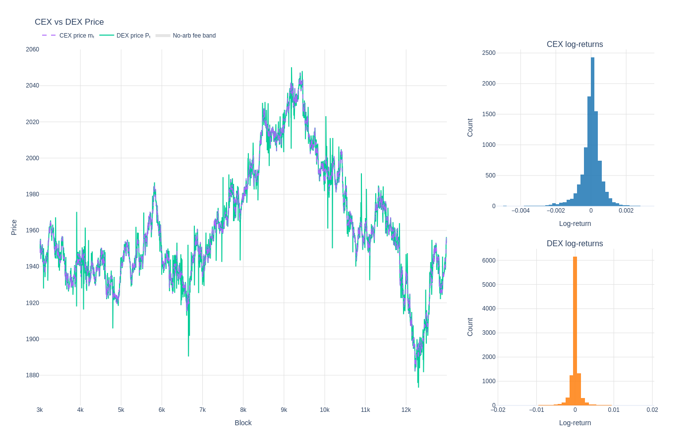
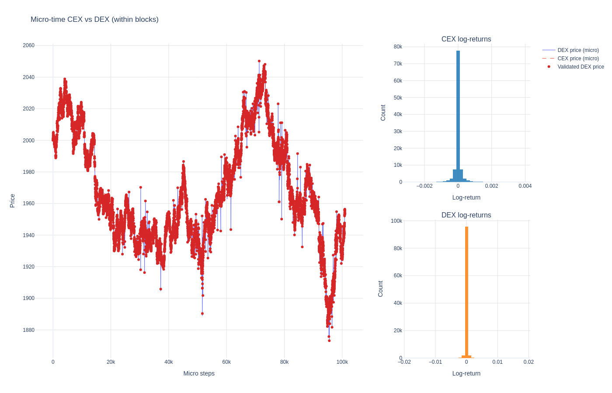
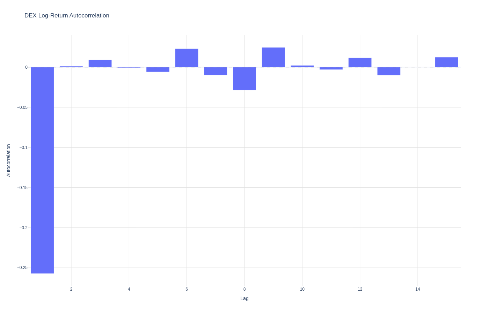
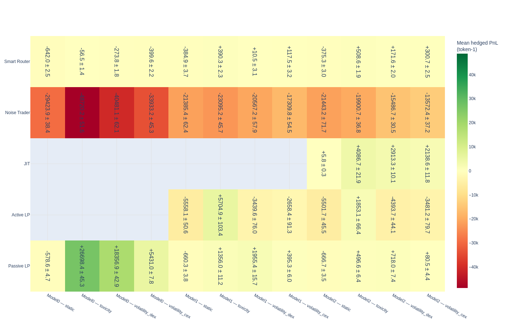
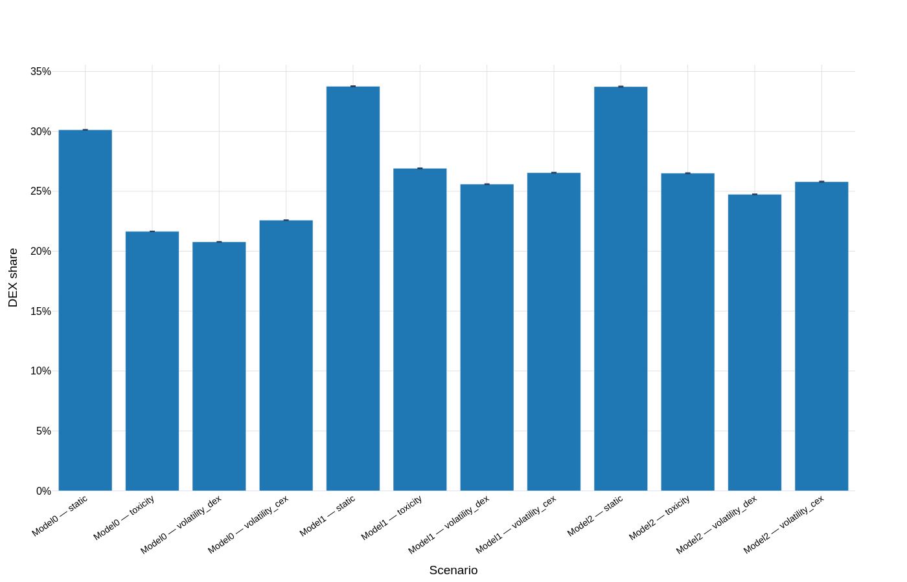
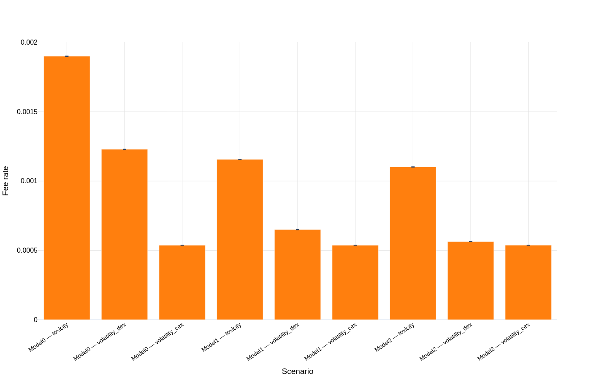
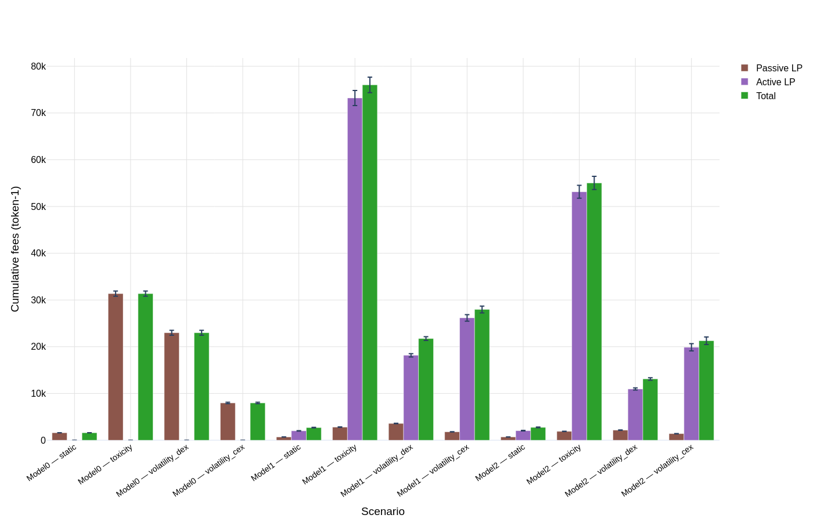
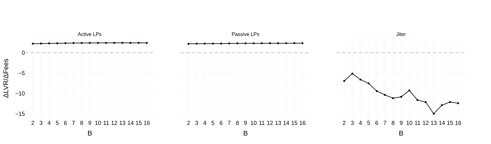
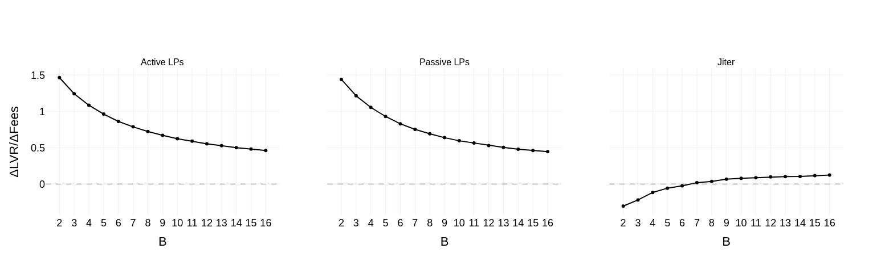

# Mitigating Adverse Selection in Concentrated Liquidity AMMs with Dynamic Fees
## An agent-based model approach (Uniswap v3 + blockchain microstructure)

Daniele Maria Di Nosse†, Fabrizio Lillo  
Scuola Normale Superiore, Pisa, Italy  
2026-02-24

<!--
Deck adapted from paper/ABM_paper.tex.
Goal: research-first model + results; avoid implementation details.
-->

---

# Motivation: Why dynamic fees?

- Concentrated liquidity boosts capital efficiency, but amplifies adverse selection risk for LPs.
- In block-based settlement, quotes become stale within the block → systematic arbitrage → **LVR**.
- Core question: can **adaptive fees** internalize adverse selection so LPs earn positive **hedged PnL**?

---

# Contribution (This Work)

- Build a granular ABM of a Uniswap v3 pool coupled to a stochastic reference market (Heston volatility + impact).
- Include blockchain microstructure: blocks, mempool latency, stochastic ordering, priority arbitrage.
- Heterogeneous agents: arbitrageur, noise trader, smart router, passive/active LPs, and a JIT “searcher”.
- Evaluate dynamic fee schedules (volatility- vs toxicity-driven) using hedged LP PnL and DEX market share.

---

# Key Metrics

LP wealth is marked at the CEX mid $m_t$. A self-financing **rebalancing benchmark** $V_t^{reb}$ tracks the LP’s inventory at $m_t$.

$$
\boxed{V_t^{LP} = V_t^{reb} + F_t - \mathrm{LVR}_t}
$$

Hedged profitability (paper definition):
$$
\Pi_t^{hedged} = F_t - \mathrm{LVR}_t - \mathbf{1}_{JIT}C_{flash}.
$$

DEX share (router competitiveness proxy):
$$
\mathrm{DEX}_{share} = \frac{\#\mathrm{DEX\ trades}}{\#(\mathrm{CEX}+\mathrm{DEX})\ trades}.
$$

---

# Timeline: Blocks + Mempool Latency

- Time indexed by blocks $t=1,\dots,T$; each block contains $B$ micro-steps (“seconds”).
- Agents condition on the last validated snapshot:
  $$
  S_t = (P_t^{DEX},\,L_t,\,m_t).
  $$
- Within the block: CEX evolves at micro-step frequency; DEX state is effectively stale for intent formation.
- At the block boundary: replay mempool (arb first, others randomized); record next snapshot.

---

# Agent Roles (High Level)

- **Arbitrageur:** enforces a fee- and funding-implied no-arbitrage band, with priority execution.
- **Smart router:** routes between CEX and DEX as a function of competitiveness (fees + liquidity).
- **Noise trader:** provides exogenous flow (generates fees and mispricings).
- **LPs:** passive (wide) vs active (narrow, frequent review/range management).
- **JIT searcher (optional):** momentarily supplies liquidity around top swap(s) to capture fees.

---

# Reference Market (CEX): Heston + Impact

Stochastic volatility (conceptual SDE):
$$
d\ln m_t = \left(\mu - \tfrac12 v_t\right)dt + \sqrt{v_t}\,dW_t^{(1)},\qquad
dv_t = \kappa(\theta-v_t)dt + \sigma_v\sqrt{v_t}\,dW_t^{(2)}.
$$

Leverage effect via $\mathrm{corr}(dW^{(1)},dW^{(2)})=\rho<0$.
Long-run variance is calibrated using Binance ETH/USD data (2023) in the paper.

Permanent price impact on the CEX from net signed token0 flow $\Delta a_\tau$:
$$
\mathrm{Impact}_\tau = \eta_{imp}\,\mathrm{sign}(\Delta a_\tau)\,\sqrt{|\Delta a_\tau|}.
$$

---

# Arbitrage: No-Arbitrage Band

Let taker fee be $f_t$ and flash-loan funding cost be $\phi_{flash}$.
The implied band for the marginal DEX price is:
$$
\boxed{
\frac{m_t(1-f_t)}{1+\phi_{flash}}
\;\le\;
P_t^{DEX}
\;\le\;
\frac{m_t(1+\phi_{flash})}{1-f_t}.
}
$$

- Outside the band, priority arbitrage trades against the AMM until the boundary is reached (or liquidity is exhausted).

---

# Fee Schedules Tested

Raw fee proposals $f_t^{raw}$ are mapped to applied fees via EWMA smoothing + bounded updates.

EWMA:
$$
v_t = \lambda v_{t-1}+(1-\lambda)x_t,
\qquad
\lambda=\exp\!\left(-\frac{\ln 2}{h}\right).
$$

Schedules in the paper:
- **Static:** $f_t=f_0$.
- **Volatility:** $f_t^{raw}\propto \sqrt{\mathrm{EWMA}((\Delta\ln m_t)^2)}$ (or DEX analog).
- **Toxicity:** $f_t^{raw}\propto$ EWMA(excess CEX–DEX log-gap outside the current fee band).

Controller: bounds $[f_{min},f_{max}]$, hysteresis ($\Delta f_{min}$), step cap ($\Delta f_{max}$), optional cooldown.

---

# Microstructure Signature: CEX vs DEX Prices

- DEX exhibits within-block spikes (aligned intrablock intents) corrected by next-block arbitrage.
- Heston leverage ($\rho<0$) produces negative skewness in CEX returns (visible in distributions).

---

<!-- # Microstructure Signature: Within-Block Lag

- CEX moves during micro-steps; DEX executes at block boundary → systematic latency-induced basis.
- Band uses a lagged reference snapshot, structurally shifting relative to contemporaneous $m_t$.

--- -->

# Microstructure Signature: DEX Return ACF

- Pronounced **negative lag-1** autocorrelation: block-time non-atomic CEX–DEX arbitrage induces short-horizon mean reversion.

<!--
Related empirical pattern discussed in the paper (see citations there).
-->

---

# Experiments: Three Model Specifications

- **Model 0:** arbitrageur, noise trader, smart router, and passive LPs only.
- **Model 1:** add an active, more concentrated LP cohort alongside passive LPs.
- **Model 2:** add a JIT liquidity provider to study MEV-style fee sniping.
- **Reporting:** 100 independent seeds per `(model, fee schedule)`; summary figures show mean ± standard error.
- **Outcomes:** hedged PnL, DEX share, and the endogenous fee level.

---

# Results: Hedged PnL Across Scenarios

- Static fees leave standing liquidity negative in every model: passive LP hedged PnL is below zero in Models 0-2, and active LPs are far more exposed once concentration is introduced.
- In Model 0, all dynamic rules make passive LPs profitable, with a clear ranking: **toxicity > DEX-volatility > CEX-volatility**.
- In Model 1, toxicity is the only controller that keeps **both** passive and active LPs positive on a hedged basis.
- In Model 2, the same ordering persists, but dynamic fees also make JIT strongly profitable, sharpening the fee-incidence trade-off.

---

# Results: Competitiveness Cost

- Static fees maximize DEX share: about **30%** in Model 0 and about **34%** in Models 1-2.
- Dynamic fees reduce routed flow to roughly **21%-27%**; toxicity produces the largest decline because it is the highest-fee regime.
- The paper’s point is not that adaptive fees eliminate order flow, but that LP protection is purchased with a measurable, partial loss of competitiveness.

---

# Results: Fee Levels and Fee Incidence

| Mean fee | Cumulative fee value |
| --- | --- |
|  |  |

- Toxicity is systematically the highest-fee regime: about **19 bps** in Model 0 and **11-12 bps** in Models 1-2.
- DEX-volatility is intermediate, while CEX-volatility remains close to **5 bps** across models.
- Higher fee income alone is not enough: under volatility-based rules, active LPs still remain hedged-negative in Models 1-2.
- Once JIT is admitted, part of the enlarged rent pool is diverted to the fast liquidity provider.

---

# Results: Economic Interpretation

- **Model 0:** adaptive fees can restore passive LP profitability without eliminating routed flow.
- **Model 1:** concentrated liquidity improves local depth but amplifies LVR; only toxicity targets adverse selection precisely enough to compensate active LPs.
- **Model 2:** the same fee adaptivity that protects standing liquidity also raises the value of JIT entry, reallocating fee income toward latency-sensitive liquidity.

---

# LVR vs Fees vs Block Size

Per-block “coverage ratio”:
$$
R_t=\frac{\Delta \mathrm{LVR}_t}{\Delta F_t}.
$$

| Static | Volatility (DEX) |
| --- | --- |
|  |  |

- Static fees: $R_t > 1$ for passive and active LPs at all block sizes; the paper reports a median coverage ratio around **2.2-2.5**.
- DEX-volatility fees: the coverage ratio declines with block size and crosses below one around **$B \gtrsim 5$**.
- For successful JIT events under dynamic fees, the ratio stays near zero and well below one, consistent with short-lived fee capture and limited LVR exposure.

---

# Conclusions & Next Steps

Main findings (paper):
- **LVR is microstructure-driven** under block settlement: latency creates systematic stale-quote arbitrage.
- **Dynamic fees help**, but only when the signal aligns with adverse selection (toxicity > volatility proxy).
- **MEV/JIT can dominate fee allocation**, potentially negating benefits for ordinary LPs.

Next steps (paper directions):
- Calibrate agent intensities/impact regimes to specific pools/chains.
- Model gas, priority fees, and auction-style ordering (full MEV supply chain).
- Explore anti-JIT fee attribution / stickiness constraints; extend to multi-pool routing.

---

# References (From the paper)

- Adams et al. (2021), *Uniswap v3 Core Whitepaper*.
- Milionis et al. (2023), *Automated Market Making and Loss-Versus-Rebalancing*.
- Heimbach et al. (2022), *Risks and Returns of Uniswap V3 Liquidity Providers*.
- Fritsch & Canidio (2024), *Measuring Arbitrage Losses and Profitability of AMM Liquidity*.
- Angeris et al. (2020), *An analysis of Uniswap markets*.
- Di Nosse et al. (2025), *Deviations from Tradition: Stylized Facts in the Era of DeFi*.
